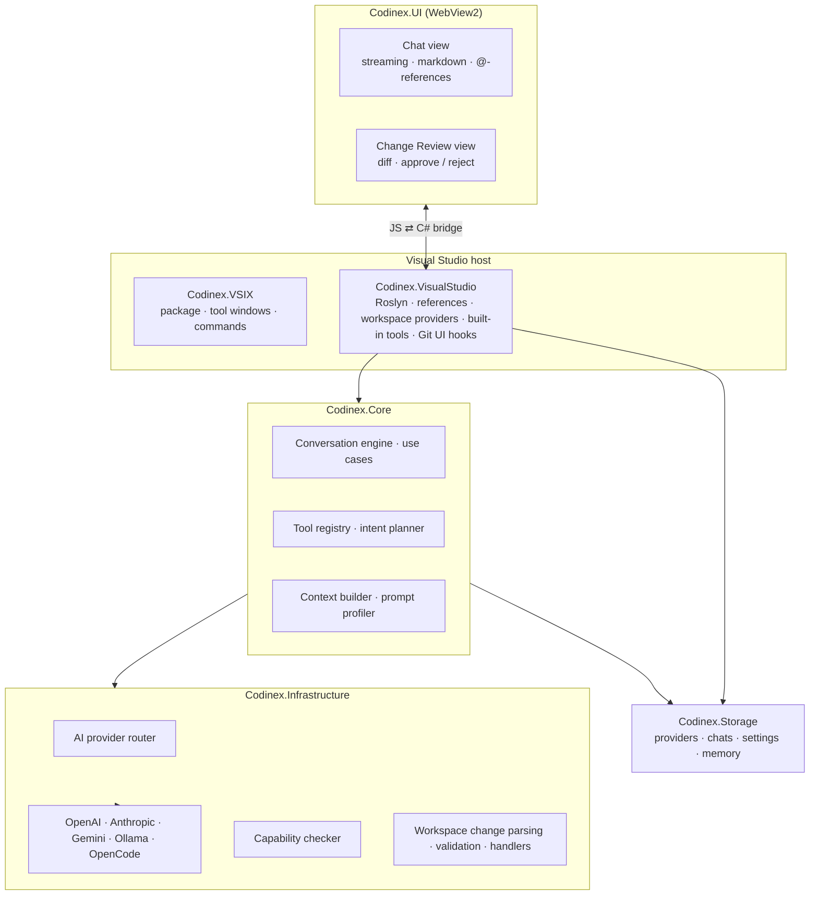

https://github.com/user-attachments/assets/cd2f360b-82a8-4693-9fe9-8d368f02be56


<!-- ⚠️ THIS PROJECT IS CURRENTLY UNDER ACTIVE DEVELOPMENT AND WILL EVOLVE AS FEATURES ARE ADDED. -->

<div align="center">


# Codinex AI

**A next‑generation, provider‑agnostic AI coding assistant for Visual Studio.**
Bring your own model — cloud or fully local — and keep control of your entire AI stack.

[-5C2D91?logo=visualstudio&logoColor=white)](https://visualstudio.microsoft.com/)
[](https://dotnet.microsoft.com/)
[](https://learn.microsoft.com/microsoft-edge/webview2/)
[](#-license)
[](#-contributing)
[](#-roadmap)

[Vision](#-vision) · [Features](#-features) · [Demo](#-demo) · [Architecture](#-architecture) · [Getting Started](#-getting-started) · [Configuration](#-configuration) · [Roadmap](#-roadmap)

</div>

---

## 🎥 Demo

<div align="center">

https://github.com/user-attachments/assets/f15c382c-9e5c-4e60-bf64-c05e83e44c92

<sub><i>From a natural‑language prompt → agentic exploration → reviewed changeset → build → tests → commit.</i></sub>

</div>

---

## 🚀 Vision

Codinex AI is an extensible Visual Studio extension inspired by GitHub Copilot — with one fundamental difference:

> 🔌 **You are not locked into a single AI provider.**

Codinex lets developers connect **any** AI backend — cloud or local — and configure their own AI pipeline end to end. That makes it especially valuable for:

- Developers who want full control over their AI stack and their data
- Teams with privacy, compliance, or air‑gap requirements
- Regions with limited or unstable access to commercial AI services
- The Iranian developer community seeking reliable local‑first AI integrations

---

## ✨ Features

### 🔌 Provider‑agnostic by design

| Capability | Details |
|---|---|
| **OpenAI‑compatible** | Any endpoint speaking the OpenAI Chat Completions API (OpenAI, Azure OpenAI, Together, Groq, OpenRouter, LiteLLM, vLLM, …). |
| **Anthropic‑compatible** | Claude Messages API and compatible gateways. |
| **Gemini‑compatible** | Google Gemini `generateContent` / streaming API. |
| **Ollama** | First‑class local runtime integration. |
| **OpenCode (free tier)** | Built‑in zero‑config provider to try the extension instantly. |
| **Custom endpoints** | Add any base URL + key; per‑provider model catalog. |
| **Capability probing** | On connect, Codinex probes each model for **streaming**, **tool‑calling**, and **reasoning** support and adapts the UI accordingly. |
| **Model management UI** | Add / remove / switch providers and models without leaving the tool window. |

### 🔐 Local‑first & offline‑friendly

- Works fully against **Ollama**, **LM Studio**, or any self‑hosted OpenAI‑compatible server.
- No cloud round‑trip required — keep source code on your machine.
- Configurable endpoints for restricted networks and proxies.

### 🤖 Agentic tools

Codinex doesn't just answer — it *acts*, through a controlled set of built‑in tools:

| Group | Tools |
|---|---|
| **Read & understand** | Read File · Read Element · Get File Elements · List Directory · Get Projects · Get Open Documents |
| **Search** | Search Project · Find References · Find Symbol |
| **Change code** | Changeset Creator (multi‑file edits gated by human review) |
| **Build & verify** | Build Project · Build Solution · Run Tests · Get Diagnostics |
| **Collaborate** | Ask‑User‑Question (structured clarification cards) |
| **Memory** | Remember Fact · Forget Fact (persists across sessions) |

### 🧩 Solution‑aware context (`@` references)

Attach precise context to any prompt: **file**, **folder**, **solution**, **class**, **interface**, **method**, **field**, or **system** references. Symbol references are **Roslyn‑powered** and stay in sync as you edit.

Ambient context providers feed the agent automatically: **Git state**, **compiler diagnostics**, **build output**, **open documents**, **project structure**, and **saved memory**.

### 🔎 Reviewed changesets

- Dedicated **Change Review** tool window with side‑by‑side and line‑level diffs.
- Syntax‑highlighted hunks; **approve or reject per change**.
- Nothing touches your working tree until you say so.

### 💬 Modern chat experience

- **Streaming** token rendering with Markdown + syntax highlighting.
- Multiple conversations / conversation groups with pagination.
- Prompt‑cache lineage pinning for faster, cheaper follow‑ups.
- **RTL / Persian language support** in the composer.
- Theme‑aware WebView2 UI that follows Visual Studio light/dark themes.
- Built‑in **About** and **Bug Report** panels.

### 🔧 Git integration

- One‑click **AI commit‑message generation**, injected directly into the Visual Studio Git changes UI.
- Git status surfaced to the agent as context.

---

## 🖼 Feature gallery

> All clips below are **placeholders**. Drop the named files into [`assets/media/`](assets/media/RECORDING.md) and they render automatically. Recording specs and the full shot list live in [`assets/media/RECORDING.md`](assets/media/RECORDING.md).

| Connect any provider | Local model, offline |
|---|---|
|  |  |

| Solution‑aware `@` references | Agentic tool chain |
|---|---|
|  |  |

| Review every change | Build & run tests from chat |
|---|---|
|  |  |

| Fix from diagnostics | AI commit messages |
|---|---|
|  |  |

| Persistent memory | RTL / Persian |
|---|---|
|  |  |

<details>
<summary>More</summary>

| Structured clarification |
|---|
|  |

</details>

---

## 🏗 Architecture

Codinex uses a layered, provider‑agnostic architecture with a WebView2 front end.



**Projects**

| Project | Responsibility |
|---|---|
| `Codinex.Core` | Domain models, conversation engine, use cases, tool contracts, context building. |
| `Codinex.Infrastructure` | AI provider adapters, capability probing, HTTP, workspace‑change parsing/validation. |
| `Codinex.Storage` | Persistence for providers, chats, settings, and memory. |
| `Codinex.VisualStudio` | VS/Roslyn integration: reference providers, workspace context, built‑in tools, Git UI hooks. |
| `Codinex.UI` | WebView2 front end (HTML/CSS/JS) for chat and change review. |
| `Codinex.VSIX` | The deployable extension package, tool windows, and commands. |

---

## 🛠 Tech stack

`C#` · `Visual Studio SDK 17.x` · `.NET Framework 4.7.2` · `WebView2` · `Roslyn` · `HTML/CSS/JavaScript` · Markdown rendering · streaming token handling · REST‑based AI communication.

Test coverage: **100+ C# test files** (xUnit) and a **Jest** suite for the WebView UI.

---

## 📦 Getting Started

> A Visual Studio Marketplace release is planned. For now, build from source.

```bash
git clone https://github.com/AliTajmirRiahi/Codinex.git
```

1. Open **`Codinex AI.slnx`** in Visual Studio 2022 (17.0+).
2. Restore NuGet packages and build the solution.
3. Set **`Codinex.VSIX`** as the startup project.
4. Press **F5** to launch the Visual Studio Experimental Instance with the extension loaded.
5. Open the **Codinex AI** tool window from the toolbar / `View → Other Windows`.

### Build the WebView UI (only if you change the front end)

```bash
cd src/Codinex.UI/ToolWindows/Resources
npm install
npm test
```

---

## ⚙️ Configuration

1. Open the Codinex AI tool window → **Settings → Add Provider**.
2. Pick a provider type (OpenAI‑compatible / Anthropic / Gemini / Ollama / custom).
3. Enter the **base URL** and **API key** (leave the key blank for local servers).
4. Codinex probes the models for streaming / tool‑calling / reasoning support.
5. Open **Manage Models**, choose a default model, and start chatting.

**Local model example (Ollama)**

| Field | Value |
|---|---|
| Provider type | Ollama |
| Base URL | `http://localhost:11434` |
| API key | *(none)* |
| Model | `qwen2.5-coder`, `llama3.1`, … |

---

## 🔮 Roadmap

- [x] ToolWindow with WebView2 UI
- [x] JS ⇄ C# bidirectional messaging
- [x] Streaming token renderer
- [x] AI provider abstraction layer (OpenAI / Anthropic / Gemini / Ollama / OpenCode)
- [x] Provider & model configuration UI
- [x] Solution‑aware `@` references (Roslyn symbols, files, folders)
- [x] Agentic built‑in tools (search, read, build, test, diagnostics, changesets)
- [x] Reviewed changesets with diff UI
- [x] Persistent memory
- [x] AI commit‑message generation in the Git UI
- [ ] Inline code completion
- [ ] Context‑aware file indexing + RAG
- [ ] Multi‑agent orchestration
- [ ] Offline‑first packaging
- [ ] Visual Studio Marketplace release

---

## 🌍 Built with the Iranian developer community in mind

Many developers face API access restrictions, payment limitations, privacy concerns, and connectivity instability. Codinex addresses this with local AI hosting, fully configurable endpoints, and an offline‑friendly design.

---

## 🤝 Contributing

Contributions are welcome — provider adapters, UI improvements, streaming optimizations, agent orchestration, performance work, and docs.

1. Open an issue describing the change.
2. Fork, branch, and keep changes focused.
3. Add/adjust tests (`Codinex.Tests` for C#, Jest for UI).
4. Open a pull request.

### Planned provider interface

```csharp
public interface IAiProvider
{
    Task<AiResponse> SendAsync(AiRequest request);
    IAsyncEnumerable<string> StreamAsync(AiRequest request);
}
```

Providers implement this contract, making Codinex fully extensible.

---

## 📜 License

MIT. *(A `LICENSE` file still needs to be added to the repository.)*

---

## 💡 Philosophy

> AI should empower developers — not restrict them.

Codinex exists to give control back to developers: **you choose your AI, your models, and where your code goes.**
